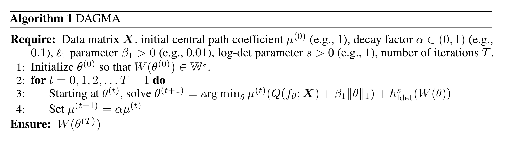

```{r setup, include=FALSE}
library(dplyr)
library(tidyr)
library(ggplot2)
knitr::opts_chunk$set(echo = F)
devtools::load_all("/Users/stefaneng/Projects/esmr")

effect_size_scale <- 0.2
h2 <- 0.3
J <- 5000
N <- 20000
pi_J <- 0.1
alpha <- 5e-8

G <- matrix(
  c(0, 0, 0, 0, 0,
    sqrt(0.3), 0, 0, 0, 0,
    0, 0, 0, 0, 0,
    0, -1*sqrt(0.1), 0, 0, 0,
    0, -1*sqrt(0.1), sqrt(0.2), sqrt(0.25), 0),
  nrow = 5,
  byrow = 5
) * effect_size_scale

G_total <- direct_to_total(G)

# Full network without the diagonal
B_lower <- lower.tri(G) + 0
B_full <- matrix(1, nrow = 5, ncol = 5)
diag(B_full) <- 0
```

## Background

## NESMR
NESMR can be broken up into two main components:

1. Estimating a given network
2. Finding the optimal network structure

### 1. Estimation
Problem 1 is largely solved by the empirical Bayes approach that esmr uses.

### 2. Optimal network structure

For small networks, the optimal network structure can be found by brute force.
For a set of $n$ traits $X_1, \ldots, X_n$ we need to first find the ordering such that a a lower triangular representation is possible.
We can then select the ordering that has the largest (log)likelihood and select this as the final network structure.
We are able to consistently estimate the causal effects using (1) with a full lower triangular matrix corresponding to the highest likelihood ordering.
Some orderings may have similar likelihoods which makes selecting a bit more difficult but some heuristics can be used to select close together orderings.
For larger networks, this is not feasible as the number of possible orderings grows factorially with the number of traits.

Our original idea was to use an algorithm that fit $n$ esmr (mvmr) steps to estimate the direct effects of $X_{-j}$ on $X_j$ for all $j = 1,\ldots, n$.
We then build a matrix of the direct mvmr causal direct effects.
This matrix is not necessarily a DAG and we need to find a DAG that is consistent with this matrix as well as a way to quantify the uncertainty in the network structure.
We fit a weighted feedback arc set algorithm (maximum acyclic subgraph) on this matrix to find the DAG that has the highest -log10 p-values.
It is possible that we could modify this algorithm to traverse the graph space using rejection sampling for a Bayesian approach to finding how often a given edge is present in the optimal network structure.

An alternative method of enforcing acyclicity is to use a continuous, differentiable penalty that is exactly zero when the matrix is acyclic and increases as the matrix becomes "more cyclic".
There are three recently proposed functions that can be used to enforce acyclicity in a continuous manner. First, let $W \circ W$ be the Hadamard product (elementwise product).
Let $W \in \mathbb R^{d \times d}$ be the weighted adjacency matrix

The first acyclicity function $h_{expm}$ is from [@zheng2018]:
A weighted adjacency matrix $W \in \mathbb R^{d \times d}$ is a DAG if and only if

$$
\begin{aligned}
  h_{expm}(W) &= tr\left( e^{W \circ W} \right) - d = 0\\
  \nabla h_{expm}(W) &= \left( e^{W \circ W} \right)^T \circ 2W
\end{aligned}
$$

The second acyclicity function $h_{poly}$ is from [@yu2019] which can be computed faster than the matrix exponential:

$$
\begin{aligned}
  h_{poly}(W) &= tr\left( \left(I + \frac{1}{d} W \circ W \right)^d\right) - d = 0
\end{aligned}
$$

The third acyclicity function $h_{ldet}$ is from [@bello2023].
There is an additional requirement that the matrix $W$ is an M-matrix.

> **Definition**: An _M-matrix_ is a matrix $A \in \mathbb R^{d \times d}$ such that $A = sI - B$ where $B \geq 0$ and $s > \rho(B)$ where $\rho$ is the specral radius (maximum absolute eigenvalue).

Define $\mathbb W^s = \{ W \in \mathbb R^{d \times d} : W = sI - B, B \geq 0, s > \rho(B) \}$.

Let $s > 0$ and let $h_{ldet}^s : \mathbb W^s \to \mathbb R$ be defined as

$$
\begin{aligned}
h_{ldet}^s(W) = -\log \det(sI - W \circ W) + d \log s\\
\nabla h_{ldet}^s(W) = 2(sI - W \circ W)^{-T} \circ W
\end{aligned}
$$

Both $h_{ldet}^s(W) = 0$ if and only if $W$ is a DAG and $\nabla h_{ldet}^s(W) = 0$ if and only if $W$ is a DAG.
The authors note that $h_{ldet}$ has nicer properties and is more computationally efficient than $h_{expm}$ and $h_{poly}$.

Some of the properties of $h_{ldet}$ are

1. It is the only one of the three functions that has a tractable expression for the Hessian.
2. No large cycles are diminished by the penalty compared to $h_{expm}$ or $h_{poly}$ which means that it works better on larger graphs.
3. Both $h_{ldet}$ and $\nabla h_{ldet}$ can be computed faster than comparable DAG characterizations.

## Proposed optimization using NESMR

The first step is to estimate the casual effects (total or direct) using NESMR.
Rather than fitting $n$ NESMR models, I modified NESMR to allow for all bi-direction effects $n (n - 1)$ total effects to be estimated at once by allowing the $B$ template to be a full matrix without the diagonal.
There may be some identifiablility issues (?) but so far the results seem similar to the $n$ MVMR steps when $G$ needs to be estimated.
There might be a better way to do this step but the benefit is that we have a full matrix of total effects as well a (log)likelihood that we can optimize.

## Simulation

First, simulate and fit with three models/methods:

1. NESMR with correct ordering lower triangular
2. NESMR with full matrix
3. MVMR discovery matrix

```{r}
kableExtra::kable(
  G,
  col.names = paste0('Trait', 1:5),
  digits = 3) %>%
  kableExtra::kable_styling()
```

```{r, eval = FALSE}
if (FALSE) {
#library(esmr)

# TODO: Why are we getting the same exact estimates for the beta?
#start_seed <- sample(1:1e8, size = 
sim_res <- replicate(100, {
  # This is weird... we get completely identical dat for 2...n simulations...
  # unless we reset the seed. Where is the seed getting set??
  set.seed(NULL)
  dat <- GWASBrewer::sim_mv(
    G = G,
    N = N,
    J = J,
    h2 = h2,
    pi = pi_J,
    sporadic_pleiotropy = TRUE,
    est_s = TRUE
  )

  Ztrue <- with(dat, beta_marg/se_beta_hat)
  pval_true <- 2*pnorm(-abs(Ztrue))
  minp <- apply(pval_true, 1, min)
  ix <- which(minp < alpha)

  # Standard NESMR with the correct ordering lower triangular matrix
  res_nesmr <- with(dat, esmr(
    beta_hat_X = beta_hat,
    se_X = s_estimate,
    variant_ix = ix,
    G = diag(5),
    direct_effect_template = B_lower,
    max_iter = 300,
    logdet_penalty = FALSE))

  # New "full" matrix of parameters
  # Still keep identity G
  res_nesmr_full <- with(dat, esmr(
    beta_hat_X = beta_hat,
    se_X = s_estimate,
    variant_ix = ix,
    G = diag(5), # required for network problem
    direct_effect_template = B_full,
    max_iter = 300,
    logdet_penalty = FALSE))

  # Build MVMR full matrix of direct effects
  MVMR_models <- lapply(seq_len(nrow(G)), function(i) {
    mvmr_minp <- apply(pval_true[,-i], 1, min)
    mvmr_ix <- which(mvmr_minp < 5e-8)

    # Estimate G at each step for fair comparison
    with(dat,
         esmr(beta_hat_Y = beta_hat[,i],
              se_Y = s_estimate[,i],
              beta_hat_X = beta_hat[,-i],
              se_X = s_estimate[,-i],
              variant_ix = mvmr_ix,
              G = NULL,
              beta_joint = TRUE)
    )
  })

  # Create matrix from the effects
  mvmr_beta_df <- do.call(
    'rbind.data.frame',
    lapply(1:5, function(i) {
      x <- MVMR_models[[i]]

      res <- x$beta[c('beta_m', 'beta_s')]
      res$to <- rep(i, 4)
      res$from <- setdiff(1:5, i)
      res
    })
  )

  mvmr_beta_edgelist <- mvmr_beta_df %>%
    select(from, to, beta_m, beta_s)

  adj_mat_beta <- matrix(0, nrow = 5, ncol = 5)
  adj_mat_beta[as.matrix(mvmr_beta_edgelist[, 1:2])] <- mvmr_beta_edgelist$beta_m

  mvmr_se <- matrix(0, nrow = 5, ncol = 5)
  mvmr_se[as.matrix(mvmr_beta_edgelist[, 1:2])] <- mvmr_beta_edgelist$beta_s

  fgbar <- t(res_nesmr_full$f$fgbar)
  fg2bar <- t(res_nesmr_full$f$fg2bar)

  list(
    #dat = dat,
    #res_nesmr = res_nesmr,
    #res_nesmr_full = res_nesmr_full,
    res_nesmr_full_effects = fgbar,
    res_nesmr_full_se = fg2bar - fgbar^2,
    mvmr_beta_edgelist = mvmr_beta_edgelist,
    mvmr_beta = adj_mat_beta,
    mvmr_se = mvmr_se
    )
  }, simplify = FALSE)

# Summarize the results
merged_res <- bind_rows(
  lapply(sim_res, function(x) {
    left_join(
      matrix_to_edgelist(x$res_nesmr_full_effects, value = 'full_beta'),
      matrix_to_edgelist(x$res_nesmr_full_effects - G_total, value = 'full_bias'),
      by = c('from', 'to')
    ) %>%
      left_join(
        matrix_to_edgelist(x$mvmr_beta, value = 'mvmr_beta'),
        by = c('from', 'to')
      ) %>%
      left_join(
        matrix_to_edgelist(x$mvmr_beta - G, value = 'mvmr_bias'),
        by = c('from', 'to')
      )
}), .id = "id") %>%
  filter(from != to)

lower_null <- matrix_to_edgelist(G, lower_tri = TRUE) %>%
  mutate(
    null_edge = value == 0,
    lower_edge = TRUE
  ) %>%
  select(-value)

upper_null <- matrix_to_edgelist(upper.tri(G), lower_tri = FALSE) %>%
  filter(value) %>%
  mutate(
    null_edge = TRUE,
    lower_edge = FALSE
  ) %>%
  select(-value)

null_edges <- bind_rows(
  lower_null,
  upper_null
)

# Add null edge information to the merged results
merged_res <- left_join(
    merged_res,
    null_edges,
    by = c('from', 'to')
  )
saveRDS(merged_res, 'nesmr_logdet.rds')
}
```

### Non-null edges

```{r, echo = FALSE}
merged_res <- readRDS('nesmr_logdet.rds')
merged_res %>%
  filter(
    !null_edge
  ) %>%
  group_by(
    from, to
  ) %>%
  summarise(
    full_bias = mean(full_bias),
    mvmr_bias = mean(mvmr_bias)
  ) %>%
  kableExtra::kable() %>%
  kableExtra::kable_styling()
```

### Null edges

```{r}
merged_res %>%
  filter(
    null_edge
  ) %>%
  group_by(
    from, to
  ) %>%
  summarise(
    full_bias = mean(full_bias),
    mvmr_bias = mean(mvmr_bias)
  ) %>%
  kableExtra::kable() %>%
  kableExtra::kable_styling()

null_res <- merged_res %>%
  filter(
    null_edge
  ) %>%
  # Convert full_bias and mvmr_bias to long format
  pivot_longer(
    cols = c(full_bias, mvmr_bias),
    names_to = 'method',
    values_to = 'bias'
  )

grouped_null_res <- null_res %>%
  group_by(from, to, method) %>%
  summarize(mean_bias = mean(bias), bias_se = sd(bias))

grouped_null_res$y.jitter <- as.numeric(interaction(grouped_null_res$from, grouped_null_res$to)) + ifelse(grouped_null_res$method == 'full_bias', 0.5, -0.1)

ggplot(grouped_null_res, aes(y = y.jitter, color = method)) +
  #geom_point(aes(x = bias, y = interaction(from, to), color = method)) +
  geom_point(
    aes(x = mean_bias), shape = 17) +
  geom_segment(aes(
    x = mean_bias - 2 * bias_se,
    xend = mean_bias + 2 * bias_se,
    yend = y.jitter
  )) +
  geom_vline(xintercept = 0, linetype = 'dashed') +
  theme_minimal()

ggplot(null_res, aes(x = bias, color = method)) +
  facet_wrap(
    ~ interaction(from, to)
  ) + 
  geom_density() +
  geom_vline(xintercept = 0, linetype = 'dashed') +
  geom_vline(
    data = grouped_null_res,
    mapping = aes(xintercept = mean_bias, color = method)
  ) +
  ggtitle("Null edges for NESMR-all vs MVMR-all complete graph") +
  theme_minimal()
```

Since the NESMR effect are the _total effects_ I used the $G_{tot}$ as the true values and for the MVMR discovery network I used $G_{dir}$
the edge from $4 \to 1$ and $5 \to 1$ will have a small total effect but no direct effect.
The edge $5 \to 2$ also has a small amount of difference between total/direct effect.
In initial simulations is appears that the NESMR full matrix is able to recover the total effects about the same as the $n$ step MVMR matrix.
I think the benefits of this are that we have an actual likelihood from the NESMR model as well as the potential to use the logdet penalty to enforce acyclicity.

### Adding Log-Det penalty to the full matrix

Simulate a single example

```{r}
library(esmr)
library(kableExtra)

effect_size_scale <- 0.2
h2 <- 0.3
J <- 5000
N <- 20000
pi_J <- 0.1
alpha <- 5e-8

G <- matrix(
  c(0, 0, 0, 0, 0,
    sqrt(0.3), 0, 0, 0, 0,
    0, 0, 0, 0, 0,
    0, -1*sqrt(0.1), 0, 0, 0,
    0, -1*sqrt(0.1), sqrt(0.2), sqrt(0.25), 0),
  nrow = 5,
  byrow = 5
) * effect_size_scale

# Full network without the diagonal
B_full <- matrix(1, nrow = 5, ncol = 5)
diag(B_full) <- 0
#set.seed(13)
dat <- GWASBrewer::sim_mv(
  G = G,
  N = N,
  J = J,
  h2 = h2,
  pi = pi_J,
  sporadic_pleiotropy = TRUE,
  est_s = TRUE
)

Ztrue <- with(dat, beta_marg/se_beta_hat)
pval_true <- 2*pnorm(-abs(Ztrue))
minp <- apply(pval_true, 1, min)
ix <- which(minp < 5e-8)

res_nesmr_full <- with(dat, esmr(
  beta_hat_X = beta_hat,
  se_X = s_estimate,
  variant_ix = ix,
  G = diag(5), # required for network problem
  direct_effect_template = B_full,
  max_iter = 300))

total_est <- t(res_nesmr_full$f$fgbar) 
```

At this point, we are at a similar place to where [@lin2023] uses network deconvolution to get direct effects.

```{r}
# Lin 2023 does almost exactly this and directly uses 
# Diagonal, e.g. cycles, are removed
# Diagonal should be all zeros if no cycles in underlying graph
direct_deconv <- total_est %*% solve(diag(ncol(G)) + total_est)
diag(direct_deconv) <- 0
```

The first approach with log-det penalty is to directly optimize the $h_{ldet}^s$ function with the total effect estimates.
An acyclic total effects adjacency matrix will be acyclic in the direct effects as well.
While there is no _guarantee_ that our total effects matrix will be an M-matrix it seems to be in practice.
Selecting $s = \max \{ \theta^2, 1 \} + 0.01$ seems to work well in practice since we will always have $s > \rho(\theta)$ and $sI - \theta$ will be negative unless there is some strange issues where there are vastly different high positive effect on the upper triangular and large negative effects on lower triangular or vise versa.
While the optimization brings the $h_{det}^s$ _close_ to zero there are still small effects that technically make this not a DAG.
We could set some threshold here to truly make it a DAG.

```{r}
d <- ncol(G)
s_max <- max(c(total_est^2, 1)) + 0.01
ix_beta <- cbind(res_nesmr_full$beta$beta_k, res_nesmr_full$beta$beta_j)

# beta_scale <- scale(res_nesmr_full$beta$beta_m)
s_max <- max(c(res_nesmr_full$beta$beta_m^2, 1)) + 0.01

result <- optim(
  par = res_nesmr_full$beta$beta_m,
  fn = h_det_vec,
  gr = h_det_grad_vec,
  ix = ix_beta,
  s = s_max,
  d = d,
  method = "BFGS",
  control = list(maxit = 2000, trace = 0)
)

# unscale(result$par)

# Build the new matrix
logdet_adj_matrix <-  matrix(0, ncol = d, nrow = d)
logdet_adj_matrix[ix_beta] <- result$par

kable(total_est, digits = 5, caption = 'NESMR total effects') %>%
  kable_styling()

kable(logdet_adj_matrix, digits = 5, caption = 'Log-Det optimized total effects') %>%
  kable_styling()
```

## Estimating standard error in the estimates

One approach to estimating the standard error in the estimates is to use resample using the standard errors from the NESMR model and combine the results into a parametric bootstrap version.

```{r}
n_resample <- 100
s_max <- max(c(total_est^2, 1)) + 0.01
ix_beta <- cbind(res_nesmr_full$beta$beta_k, res_nesmr_full$beta$beta_j)

resample_results <- lapply(seq_len(n_resample), function(i) {
  beta_resample <- res_nesmr_full$beta$beta_m + sapply(res_nesmr_full$beta$beta_s, rnorm, n = 1, mean = 0)
  # s_max_reample <- max(beta_resample^2, 1) + 0.01
  result <- optim(
    par = beta_resample,
    fn = h_det_vec,
    gr = h_det_grad_vec,
    ix = ix_beta,
    s = s_max,
    d = d,
    method = "BFGS",
    control = list(maxit = 2000, trace = 0)
  )
  
  
  list(
    beta = result$par,
    value = result$value
    )
  })

# resample_results
# test_digits <- seq(10, 5, by = -1)
# round_results <- lapply(resample_results, function(x) {
#   val <- x$value
#   i <- 1
#   while(val != 0 && i > length(test_digits)) {
#     round_beta <- round(x$beta, digits = test_digits[i])
#     val <- h_det_vec(round_beta, ix = ix_beta, s = s_max, d = d)
#     i <- i + 1
#   }
#   if (val != 0) {
#     # print('No solution found')
#     return(-1)
#   } else {
#     return(test_digits)
#   }
# })
```

Can we say something like... we need to round to XX digits to get h_det truly == 0?


### Alternative approach

An alternative approach copies the algorithm from [@bello2023] and uses the log-likelihood as the objective function.

Let $\theta = \{ \beta_{i,j} : i \not = j, i,j = 1,2, \ldots, n\}$
We then use a modified version of the [@bello2023] optimization

$$
\min_\theta L (\theta) + \gamma_1 \|\theta\|_1 \quad \text{subject to } h_{ldet}^s(W(\theta)) = 0
$$

where $\gamma_1$ is an $\ell_1$ penalty.
Note that this might not be necessary or desired since esmr already does some shrinkage.





```{r, eval = FALSE}
s_max <- max(total_effects^2, 1) + 0.01

# Not sure if this is the right way to do this...
# This is basically a copy of the paper's algorithm
# Really slow!!! decaying (numeric MLE + l1 penalty) + h_det
ix_beta <- cbind(res_nesmr_full$beta$beta_k, res_nesmr_full$beta$beta_j)
max_iter <- 10
mu_t <- vector('integer', length = max_iter)
mu_t <- c(1, 2^(-seq_len(max_iter - 2)), 0)
l1_param <- 0.01
optim_res <- list()
for (i in seq_len(max_iter)) {
  optim_res[[i]] <- optim(
    par = res_nesmr_full$beta$beta_m,
    fn = function(x) {
      adj_mat_beta <- matrix(0, nrow = 5, ncol = 5)
      adj_mat_beta[ix_beta] <- x
      h_det_res <- h_det(adj_mat_beta, s = s_max + 0.1)
      if (is.nan(h_det_res)) {
        browser()
      }
      mu_t[i] * (-log_py(res_nesmr_full, beta = x) + l1_param * sum(abs(x))) + h_det_res
    },
    method = 'L-BFGS-B',
    control = list(trace = 6, maxit = 10)
  )
  print(optim_res)
}

## Step 2
# Just optimizing the logdet part
adj_mat_beta <- matrix(0, nrow = 5, ncol = 5)
adj_mat_beta[ix_beta] <- optim_res[[max_iter]]$par
```

## Issues and Future Work

The idea with log-det is promising but there are a few questions to answer before moving forward:

  - This again selects a "best" DAG structure but it is unclear how we could find other DAGs that are close by
  - I am not sure how we can propogate the standard error from the original NESMR standard errors into the log-det optimization
    - It seems like it should be possible but I am not sure how to do it
  - Potential identifiability issues if we allow for all $n(n-1)$ effects to be estimated at once
  - Unclear how we show consistency for network estimation

## References
